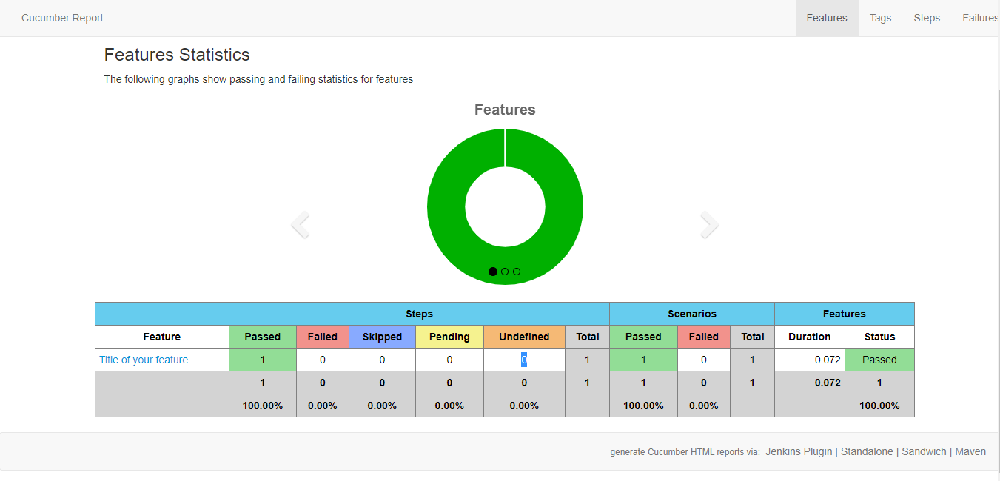

# Selenium Cucumber framework

## Introduction

Selenium Webdriver + Junin+ Cucumber + Page Object Model + Maven + Cucumber Reporting
This project comes with library support to automate Web applications using Selenium WebDriver + Java and extended support to write BDD files using cucmber and reporting using cucumber reporting

## Author

* **Vinutha krishnamurthy (vinuthakbapu@gmail.com)** 

##Steps

####Run locally
1. Navigate to src/test/resources/*.feature
2. Run As --> Cucumber feature
 
#### Run using maven dependecies
mvn test

#### Sample Report

[CucumberFeatureReport.html](target/cucumber-html-reports/cucumber-html-reports/overview-features.html)

